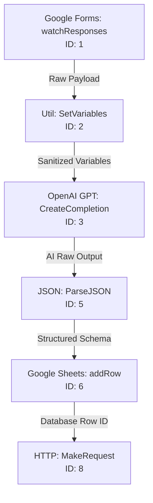

# Sales Lead Intake Assistant

### A Resilient, Low-Code Revenue Engine Built on Make.com for Automated Lead Intake, AI Context Processing, and CRM Synchronization.

---

## Business Value & Impact (The RevOps Strategy)

In modern high-growth tech startups, **speed-to-lead** is the single most critical predictor of sales conversion. Research indicates that reaching out to an inbound prospect within 60 seconds of submission increases qualification rates by up to 391% compared to waiting even 30 minutes. The **Sales Lead Intake Assistant** is an enterprise-grade Revenue Operations (RevOps) engine designed to systematically reduce speed-to-lead to **under 60 seconds**.

### Displacing Expensive SaaS Middleware
Historically, achieving this level of responsiveness and intelligent triage required rigid, expensive enterprise SaaS intake platforms (e.g., Typeform Enterprise, custom Zapier accounts with high-tier usage fees, or complex third-party middleware) costing thousands of dollars annually. This workflow eliminates that overhead by utilizing a serverless Make.com architecture and direct API calls. By bypassing third-party wrappers and connecting webhooks directly to AI processing models, organizations gain full control over their logic, payload parsing, and SaaS spend.

### Unstructured-to-Relational Transformation
Incoming leads typically submit unstructured inquiries containing diverse business goals, timelines, and budget constraints. This engine acts as a semantic gateway, utilizing a Large Language Model (LLM) reasoning block to parse, classify, and normalize raw client text into clean, relational database parameters. By structuring fields such as `lead_type`, `urgency`, and `next_step` on ingestion, the business can instantly trigger automated routing, SLA alerts, and targeted email nurture campaigns.

---

## Workflow Architecture & Pipeline Modules

This automation ingestion pipeline processes leads linearly through a series of dedicated utility and integration modules. The architecture ensures that raw client data is formatted, analyzed, recorded, and broadcasted within a single execution cycle.



### Module-by-Module Data Flow

#### 1. Inbound Lead Trigger: Google Forms (`google-forms:watchResponses` | Module ID: `1`)
*   **Purpose:** Captures incoming form submissions in real time.
*   **Configuration:** Listens to the target form `"AI Services Inquiry Form"` (`formId: 1cxD9iRF3GDxEyYbtZpYTGQgRrF5pGkooiNxa_U9pBvg`).
*   **Data Captured:** Extracting Name, Company, Email, Phone, Service Interest, Inquiry, Timeline, and Budget Range.

#### 2. Data Cleaning & Variable Initialization: Util (`util:SetVariables` | Module ID: `2`)
*   **Purpose:** Standardizes raw form answers and stores them in the execution scope, mitigating nested-array bugs common to Google Forms payload arrays.
*   **Variables Declared:**
    *   `full_name`: `{{1.answers.5bce1d82.textAnswers.answers[].value}}`
    *   `company`: `{{1.answers.38a29399.textAnswers.answers[].value}}`
    *   `email`: `{{1.answers.20d2a3c4.textAnswers.answers[].value}}`
    *   `phone`: `{{1.answers.6ad342bd.textAnswers.answers[].value}}`
    *   `service_interest`: `{{1.answers.1b344222.textAnswers.answers[].value}}`
    *   `inquiry`: `{{1.answers.3274f50b.textAnswers.answers[].value}}`
    *   `timeline`: `{{1.answers.7514ea50.textAnswers.answers[].value}}`
    *   `budget`: `{{1.answers.76beb515.textAnswers.answers[].value}}`

#### 3. AI Semantic Reasoning: OpenAI (`openai-gpt-3:CreateCompletion` | Module ID: `3`)
*   **Purpose:** Evaluates lead content for classification, summary, and prioritization.
*   **Configuration:** Utilizes OpenAI's reasoning engine models (e.g., standard `gpt-4o` or compatible endpoints) with a temperature set to `0.2` for highly deterministic, repeatable outputs.
*   **System Rules Prompted:**
    *   Extract `lead_type` (Strict Enum: `Sales Inquiry`, `Support Request`, `Partnership`, `General Question`).
    *   Extract `urgency` (Strict Enum: `High`, `Medium`, `Low`).
    *   Summarize query in under 2 sentences.
    *   Recommend a 1-sentence next step.
    *   Output strictly raw JSON conforming to defined keys.

#### 4. Schema Deserialization: JSON (`json:ParseJSON` | Module ID: `5`)
*   **Purpose:** Parses the stringified JSON block generated by OpenAI (`{{3.result}}`) into distinct, strongly-typed variables.
*   **Output Keys:** `lead_type`, `urgency`, `summary`, `next_step`.

#### 5. Relational Ledger Logging: Google Sheets (`google-sheets:addRow` | Module ID: `6`)
*   **Purpose:** Acts as a relational lead ledger, logging the record for historical audit and sales reference.
*   **Target Sheet:** Spreadsheet `/1VwQXm-tNQvBv9TyYk8wX1jvOxcjvqU8YkLCzi--zV1c`, Sheet: `"Processed Leads"`.
*   **Columns Mapped:** Mapped with a blend of raw contact data and AI-enriched attributes (setting the initial lead status to `"New"`).

#### 6. Real-Time Notification Hub: HTTP (`http:MakeRequest` | Module ID: `8`)
*   **Purpose:** Dispatches instant alerts containing contact info, lead classification, and urgency indicators.
*   **Configuration:** Generates a `POST` request to the target Google Chat spaces incoming webhook.
*   **Payload Format:** Formats a structured text notification highlighting the prospect's details and the AI's triage summary.

---

## The SRE Edge: Resiliency & Error Handling Guardrails

Standard low-code workflows built by non-engineers are notoriously brittle; a single transient API timeout, rate limit (HTTP 429), or malformed client payload will crash the scenario and cause catastrophic lead leakage. This pipeline is engineered using Site Reliability Engineering (SRE) principles to maximize uptime, handle failures gracefully, and prevent data loss.

### Scenario-Level Guardrails
*   **Auto-Commit:** Enabled (`autoCommit: true`). Ensures that if a step fails halfway, completed writes (like data logged to Google Sheets) are safely committed, avoiding duplicate executions.
*   **Max Errors limit:** Configured to `3` consecutive errors before halting execution, preventing runaway loop charges while accommodating intermittent platform hiccups.

### Module-Level Resiliency Design (Recommended Implementations)
To ensure production-grade reliability under high volume, standard error-handling directives should be configured at key integration points:

```
[OpenAI API Call]
       │
       ├── (Error: Timeout / Rate Limit 429 / Service Outage)
       └── [Break Directive] ──> Retry 5x (Exponential Backoff: 1 min, 2 min, 4 min...)
```

1.  **Transient API Retries (`Break` Directive):** 
    Downstream LLM APIs and HTTP webhooks are subject to rate limiting and temporary downtime. By attaching a **Break** directive to the OpenAI and HTTP modules, Make.com will automatically store failed executions in a queue and retry them with exponential backoff (e.g., retrying 5 times over several hours) before marking them as failed.
2.  **Fallback Ingestion (`Resume` Directive):**
    If the OpenAI module experiences an extended outage or returns unparseable JSON, a **Resume** directive can be configured on the `json:ParseJSON` module. This directive injects static fallback values:
    *   `lead_type`: `"General Question"`
    *   `urgency`: `"Medium"`
    *   `summary`: `"Automatic fallback summary: System experienced temporary AI processing degradation."`
    *   `next_step`: `"Manually review lead details immediately."`
    This ensures that even when the AI fails, the lead is safely written to Google Sheets and alerted to the team rather than dropped.

---

## Cybersecurity, Privacy & Data Governance

When routing customer data through automated workflows, maintaining compliance with data protection regulations (e.g., GDPR, CCPA) is paramount. This blueprint is designed with security-first architecture.

### Data Transit & Classification
*   **End-to-End Encryption:** All data in transit is encrypted using HTTPS (TLS 1.2 or higher) directly between the APIs of Google Workspace, OpenAI, and Make.com.
*   **PII Containment:** By avoiding third-party automation wrappers (middleware tools that store copy payloads in proprietary databases), Personally Identifiable Information (PII) is kept inside secure, certified corporate environments (Google Workspace and OpenAI enterprise endpoints).
*   **Zero Data Retention (Optional Enterprise Layer):** When utilizing the OpenAI API module, data sent via API calls is not used to train future OpenAI models, aligning with enterprise corporate data compliance policies.

### Payload Validation & Injection Mitigation
*   **Object Isolation via SetVariables:** Google Forms outputs can sometimes carry nested raw JSON blocks or script payloads. The `util:SetVariables` module acts as a sanitization barrier, mapping only the text index (`textAnswers.answers[].value`) of the form submission. This prevents data formatting errors in downstream modules.
*   **Prompt Jailbreak Defenses:** The OpenAI system prompt explicitly enforces strict formatting rules: `"Return valid JSON only. Do not include markdown. Use these exact keys..."` This constraints-based prompt prevents malicious form-field submissions (e.g., entering system instructions in the contact form) from altering the workflow execution path.

---

## Redeployment & Setup Guide

This repository contains the complete JSON configuration blueprint for the Sales Lead Intake Assistant. Follow this guide to deploy this workflow into your own Make.com instance.

### Prerequisites
*   A **Make.com** account.
*   A **Google Account** with permissions to create Google Forms and Google Sheets.
*   An **OpenAI API Key** (with access to chat completion models).
*   A Google Chat Space Webhook URL (or Slack webhook URL modified to match your notification tool).

### Step 1: Create Lead Tracker & Intake Form
1.  **Google Sheet Setup:** Create a new Google Sheet named `Lead Tracker` and rename the active worksheet to `Processed Leads`. Set up the following headers in Row 1:
    *   `Date Submitted` | `Full Name` | `Company` | `Email` | `Phone` | `Service Interest` | `Inquiry` | `Timeline` | `Budget` | `Lead Type` | `Urgency` | `AI Summary` | `Recommended Next Steps` | `Status`
2.  **Google Form Setup:** Create a Google Form with questions matching the variable mappings:
    *   Full Name (Short text)
    *   Company Name (Short text)
    *   Email Address (Short text)
    *   Phone Number (Short text)
    *   Service Interest (Multiple choice or text)
    *   Inquiry / What do you need help with? (Long paragraph text)
    *   Timeline (Short text)
    *   Budget (Short text)
3.  Ensure the Google Form is configured to save responses to a spreadsheet, or note its Form ID from the URL (`docs.google.com/forms/d/[FORM_ID]/edit`).

### Step 2: Import the Make.com Blueprint
1.  Navigate to your **Make.com Dashboard**.
2.  Click **Scenarios** in the left sidebar, then click **Create a new scenario** in the upper right.
3.  In the scenario builder, click the three dots (`...`) icon at the bottom of the screen.
4.  Select **Import Blueprint** from the menu.
5.  Upload the `Sales Lead Intake Assistant.blueprint.json` file from this repository.
6.  The visual nodes and layout will generate automatically.

### Step 3: Rehydrate Connections & Environmental Keys
Since blueprints do not export private credentials or specific resource IDs, you must reconnect the modules:

| Module ID | Module Name | Required Action |
| :--- | :--- | :--- |
| **Module 1** | Google Forms | Click **Add** to create a connection to your Google account. Select the form you created in Step 1. |
| **Module 3** | OpenAI | Click **Add** to establish a connection using your OpenAI API Key (`sk-...`). Confirm the model is set to `gpt-4o` or your preferred stable completion engine. |
| **Module 6** | Google Sheets | Re-authenticate your Google connection. Select the spreadsheet created in Step 1, target the `Processed Leads` sheet, and ensure headers map to the respective keys. |
| **Module 8** | HTTP | Paste your Google Chat Space incoming webhook URL into the **URL** field. If routing to Slack, change the URL to your Slack webhook URL and adjust the payload structure accordingly. |

### Step 4: Verification & Go-Live
1.  Click **Save** (disk icon) in the Make.com builder toolbar.
2.  Click **Run once** at the bottom left to place the scenario in listening mode.
3.  Submit a test response through your live Google Form.
4.  Monitor the Make scenario editor to confirm all visual nodes execute successfully (marked by green checkmarks).
5.  Verify that:
    *   A new row appears in your Google Sheet with both raw contact information and AI-enriched classifications.
    *   A notification alert is posted in your Google Chat Space.
6.  Once verified, toggle the **SCHEDULING** switch in the bottom left to **ON** to run the intake automation continuously.